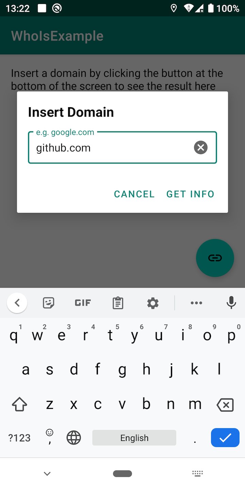
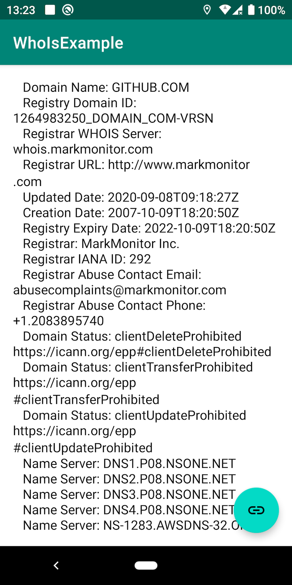

# DomainInfo

An android library to get domain info (whois) from any android application. This library uses the 
latest kotlin language including **coroutine**. The **whois** info is obtained with 
**org.apache.commons.net.whois.WhoisClient**

[](https://jitpack.io/#arhanashik/DomainInfo)


## Preview - Sample app
|Input|Result|
|---|---|
|||

## Setup
**Step 1:** Add it in your root build.gradle at the end of repositories:
```
allprojects {
    repositories {
        ...
        maven { url 'https://jitpack.io' }
    }
}
```
Add the dependency:
```
implementation 'com.github.arhanashik:DomainInfo:1.1.0'
```
That's it. You are good to go!

## How to use
Using this library is as simple as below:
```kotlin
DomainInfo(domain).findAsync(object: DomainInfoCallback {
    override fun onResponse(result: Result<String>) {
        when(result) {
            is Result.Success -> {
                //result.data is the result
            }
            is Result.Error -> {
                //result.exception is the error
            }
        }
    }
})
```
**domain** is the domain name from which the info will be obtained.

You can also use the simplest direct function if you don't want a callback.
```kotlin
val result = DomainInfo(domain).find()
```
**Be careful. This is a UI blocking function. So you must have to use coroutine.** Example: 
```kotlin
CoroutineScope(Dispatchers.IO).launch {
    val result = DomainInfo(domain).find()
}
```

## Others
For more information please check the sample project.
The library is free to use. If you wish to improve it, please create a separate branch and make pull request.

## Changelog:
### 1.1.0
------------
- WHoIsClient added as jar lib

### 1.0.0
------------
- DomainInfo using WhoIsClient.
- Sealed class to provide the response

## Thanks!
Thank you for reading and using the library!

## Contact
For any question or suggestion feel free to send an email:
**ashik.pstu.cse@gmail.com**

## License
                                 Apache License
                           Version 2.0, January 2004
                        http://www.apache.org/licenses/
